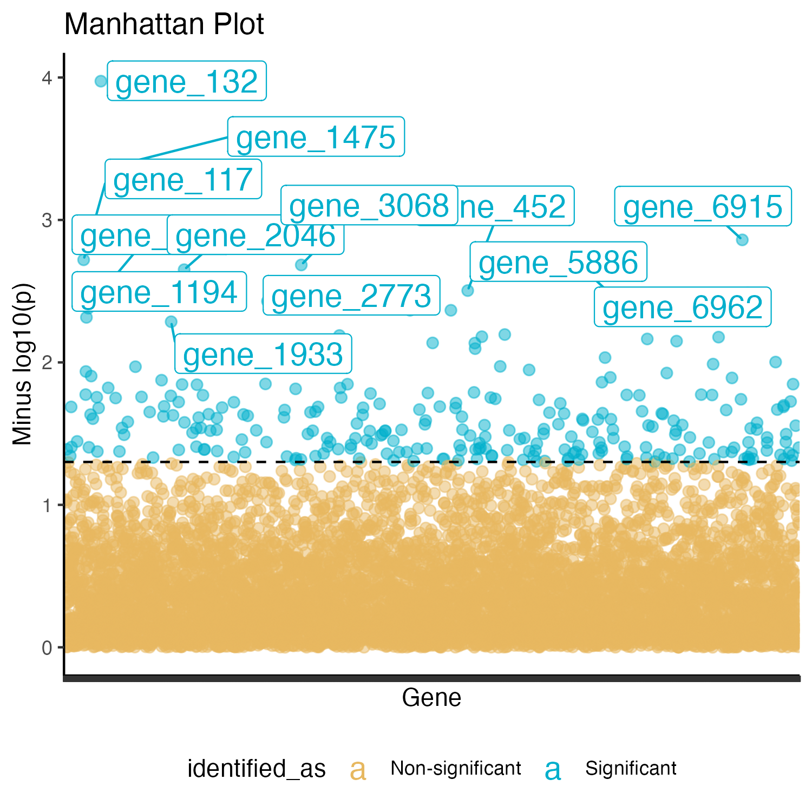
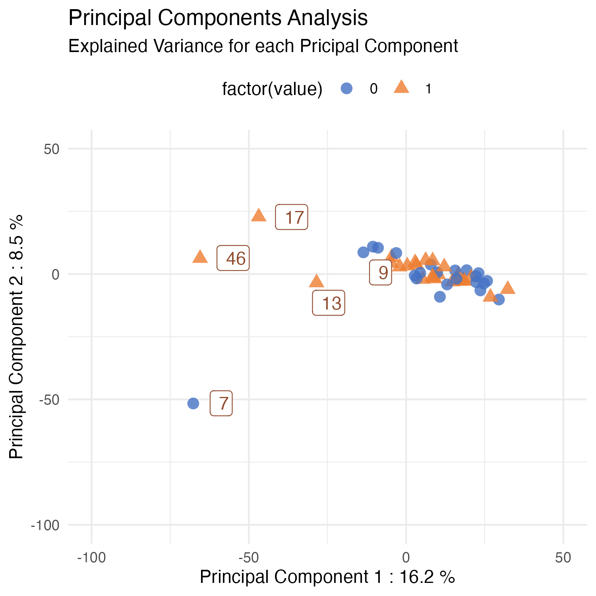
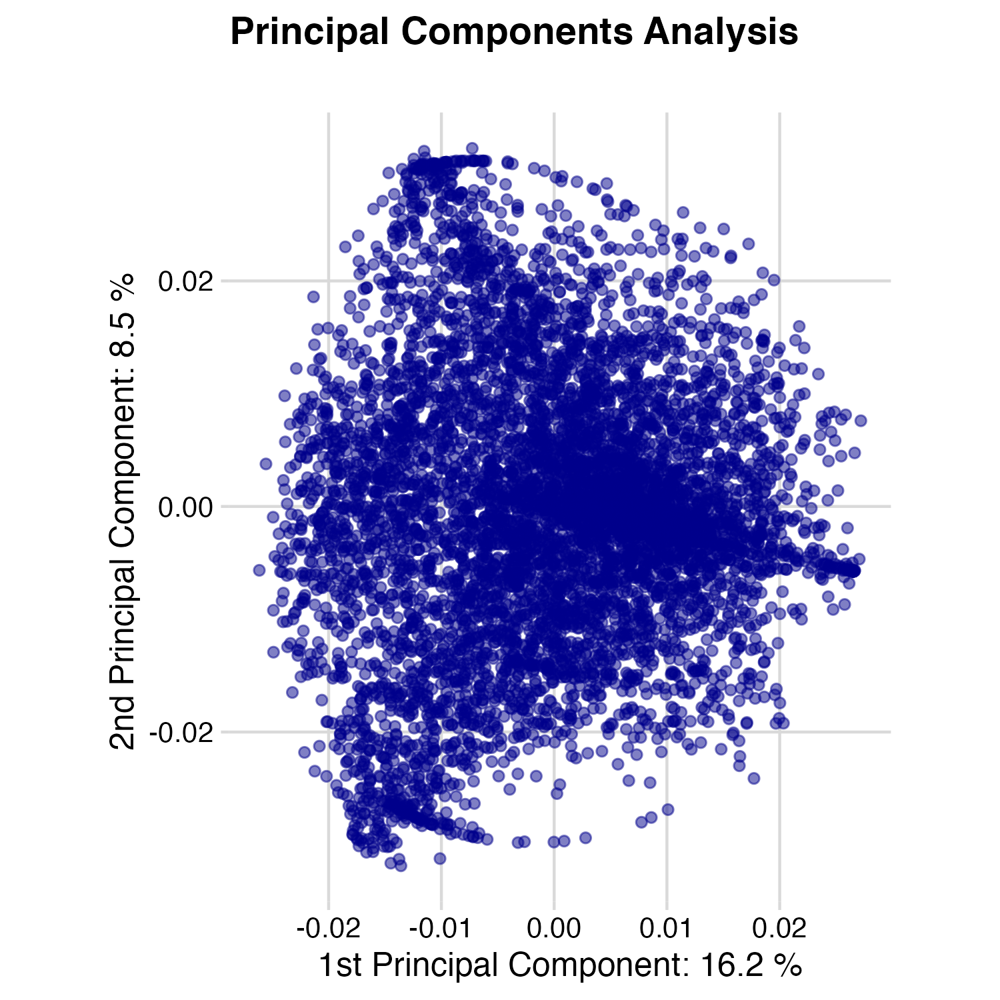
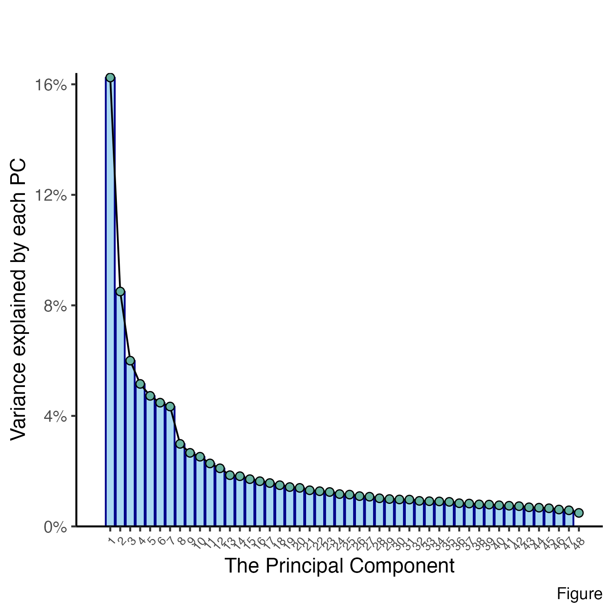
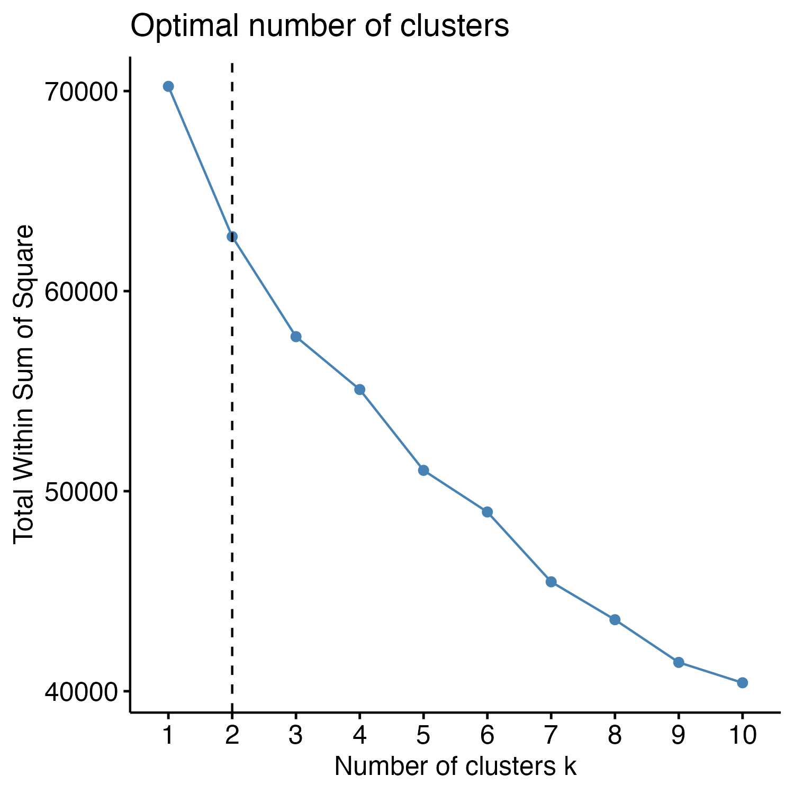
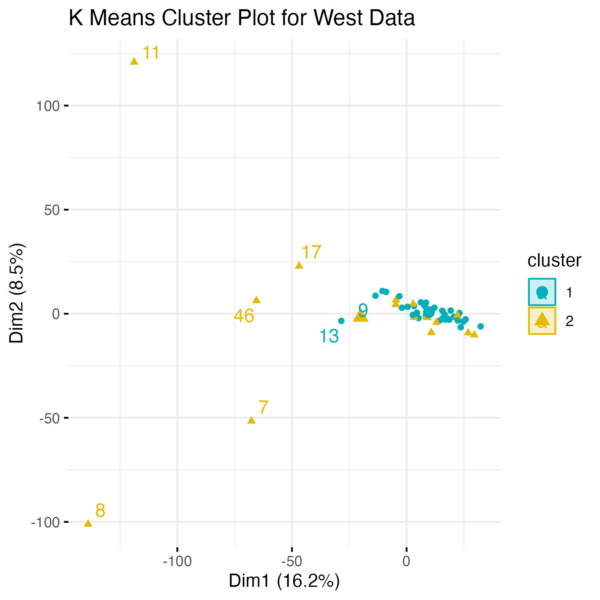

```{r setup, include=FALSE}
knitr::opts_chunk$set(echo = TRUE)
```


### Introduction 

***
( Note : Remember to hit w and f)
(10 slides in 10 minutes)
Instructions: 

* Include certain decisions you took with the data and your reasoning therefore.

*  If you found a particular challenging problem in coding, to which you found an elegant
solution, include that in your presentation as an example

*  The presentation is your chance to practice communicating insights to stakeholders

*  Your audience will be same-level bioinformaticians

*  Perhaps consider a graphical representation of your process going from raw to
analysis-ready data


### Materials and Methods

What data did you use and where did you get it from?

Which modelling did you use? 

Think of the methods section as a recipe for how to go from raw to results => Flow chart?

***

### Results

```{r, fig.align='left', out.width='50%}












```

***

### Discussion 

***

### Demonstration of the Shiny App
